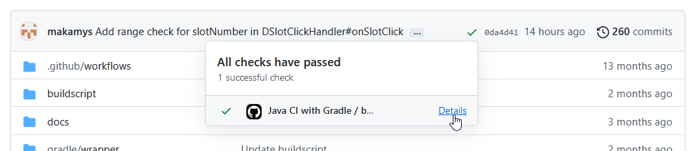
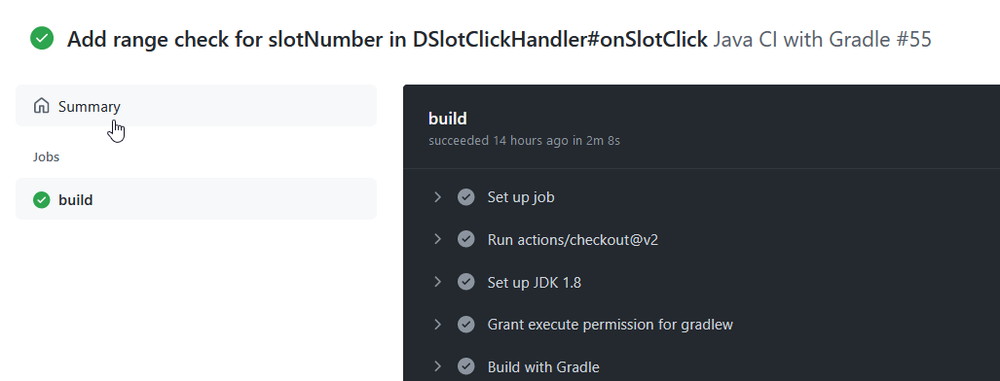
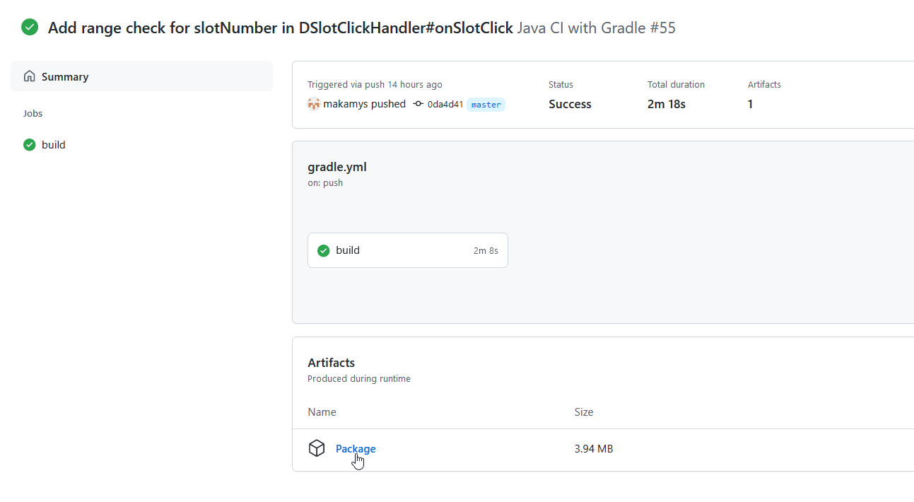

# About CI builds

This project uses continuous integration via *Github Actions* to automatically build the project whenever new commits are pushed. These builds contain the latest changes, but have not been tested thoroughly yet.

Use them if you want to help test new changes. If you encounter any issues, please report them on the Issues tab!

## How to download CI builds
1. Click the **checkmark** next to a commit, then click **Details** to open its CI run.

2. Click **Summary** in the sidebar on the left.

3. Click **Package** to download a zip containing the results of the build. Note that you need to be signed into GitHub to do this.

Alternatively, the Actions tab can be used to view the list of CI runs, but it may be more difficult to navigate if the project has multiple branches and/or pull requests.

---

[< Go back](javascript:history.back())